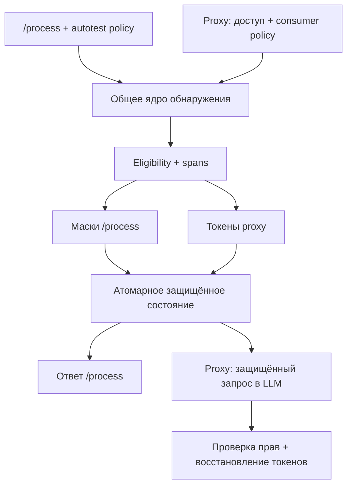

# Архитектура AlfaGen PII — baseline v1

## 1. Границы решения

Статус: зафиксировано для реализации по поручению команды. Реализация и измерения ещё не выполнены. Основа — три предоставленных командой артефакта. Официальные первичные документы организаторов в этом проходе не предоставлены; изложенный в них контракт переносится из ваших артефактов, а не выдаётся за независимо перепроверенный.

Два входа используют одно ядро: `POST /process` для mask/demask без бизнес-LLM и отдельный авторизованный proxy. `/process` не получает обязательных новых полей или API-ключа. Это тестовый вход: не использовать его как публичный production API для настоящих ПД. Ограничить его сетевую доступность согласованным контуром проверки. `payload_id` не является авторизацией.

Маршрут к LLM доступен только proxy; `/process` никогда не вызывает LLM. Любой detector может пропустить данные: абсолютная гарантия отсутствия всех ПД не заявляется. Fail-closed защищает от отказа компонента, но не исправляет false negatives модели.

## 2. Контракт /process

Вход: `{"payload":"строка","payload_id":"идентификатор"}`. Выход 200: `{"result":"строка"}`.
Проектный default: payload — строка, в том числе пустая; ID — непустая строка, сравниваемая без нормализации. Типы не приводить молча. Если официальный контракт задаёт иначе, исправить DTO и тесты.

| Вход при существующей операции | Результат |
|---|---|
| Исходный payload | Та же сохранённая маска |
| Ранее возвращённая маска | Точный исходный payload |
| Любой другой payload | 409 |
| Оригинал равен маске, включая пустую строку | Та же строка; обе ветки эквивалентны |

Невалидный JSON/DTO → 400; перегрузка → 429 + Retry-After; обязательный detector/storage недоступен → 503. Истёкшая операция с сохранённым маркером → 410. Это наши error defaults, не подтверждённые коды официального тестера.

## 3. Состояние и конкурентные запросы

Redis — единственное общее состояние для API workers. RAM допустима только в unit tests. Ключ — namespace + HMAC от length-prefixed идентификаторов, без raw payload/ПД. Namespaces `/process` и proxy разделены; proxy включает consumer_id и operation_id.

Новый запрос: detection → eligibility → resolver → mask → подготовка целого state → атомарное создание. В Redis одной транзакционной операцией/Lua публикуются live state с TTL 3600 секунд и неперсональный seen-marker с TTL 86400 секунд. Создать можно только если нет live state и seen-marker. TTL устанавливается в той же операции, а не отдельным EXPIRE. Проигравший worker перечитывает победившую запись и сравнивает fingerprints; свой результат не возвращает.

Храним HMAC-SHA-256 исходной и маскированной UTF-8 строки, зашифрованный masked_result, зашифрованные замены с позициями в маске, версии rules/model/policy/mask, время создания и истечения. Для proxy дополнительно exact allowlist выпущенных токенов. Полный оригинал отдельно не дублируется, но всё восстановимое состояние считается чувствительным.

Шифрование: стандартная библиотечная AES-GCM, свежий nonce, AAD с namespace/operation, key_id. HMAC и encryption keys раздельные. Не писать собственную криптографию; секретов нет в репозитории, логах, архиве. После смены ключей старые нужны до истечения соответствующих операций.

При наличии live state HMAC определяет retry/demask/conflict. Повтор не продлевает TTL. При наличии только seen-marker → 410, не трактовать маску как новый оригинал. После исчезновения обоих записей отличить старый ID от нового невозможно: гарантия определения истечения ограничена 24 часами. После полной потери Redis восстановление не гарантируется; не симулировать успех. Redis не выставлять наружу, использовать volume и AOF для demo, noeviction; нехватка памяти → управляемая ошибка. AOF не заявляется как абсолютная гарантия сохранности.

## 4. Маски и восстановление

`dev_redact_v1` — временная проектная стратегия, не эталон Альфы. Внутри принятых spans Unicode-буквы и цифры становятся `*`, остальные символы сохраняются. Вне spans строка неизменна. Составной реквизит с метками «серия», «номер» отдаёт два spans только значений. Маскирование — один проход по отсортированным spans. Для восстановления хранятся исходные значения и позиции замен в полученной маске. Обратная проверка сравнивает значение строки после JSON-декодирования, не байты JSON-экранирования.

`reference_v1` добавляется по подтверждённым примерам организаторов. До этого `/process` работает с dev_redact_v1, а совместимость официальной маски помечена «не проверена». Изменение стратегии не меняет уже записанные операции: их маска и версия сохранены.

Proxy: `⟦PII_TYPE_<32 hex>⟧`, не менее 128 случайных бит на токен. Проверить отсутствие токена во входе и коллизий внутри операции. Каждое вхождение получает отдельный токен. Восстанавливать одним проходом только точные выпущенные токены своей операции после проверки текущей политики и владельца. Не выполнять рекурсивную замену токенов, случайно находящихся в исходных значениях. Неизвестные/повреждённые токены остаются безопасным текстом, без угадывания. Случайный токен предотвращает коллизии, но не запрещает LLM копировать уже виденный валидный токен: это ограничение, а не защита от всех prompt injections.

## 5. Policy и минимальная реализация

Python/FastAPI + Redis. NER — локальный `NerAdapter`, первоначально Natasha/Slovnet; версии закрепить после успешной установки в Cursor. Модель загружается один раз на worker; CPU-вызовы не блокируют event loop; ограничить одновременный inference. Отдельного NER-сервиса и fine-tuning в v1 нет. Если модель не стартует, не подменять её незаметно заглушкой.

`autotest_default_v1`: включены все 17 canonical типов из DETECTION.md, `dev_redact_v1`, TTL 3600, typed hard-negative policy из матрицы, LLM выключена. Для unit detector cases временно включён только target_type; это не конфигурация сдаваемого endpoint.

Proxy: credentials → consumer из серверного allowlist (не из доверенного поля клиента), enabled_types, mask_types, demask_allowed, TTL. Передача только защищённого prompt; raw text не попадает в system prompt, tracing, exceptions, metadata или history. В v1 вход proxy — один текст, без файлов, инструментов, streaming и истории чата. Если расширять API, защищать все поля, а не только последний user message. Endpoint proxy и модель подключаются после P0 /process.

## 6. Проверка и граница готовности

Архитектурная фаза закрыта наличием этого контракта, enum, policy, приоритетов, state machine и приёмочных примеров. Не требуется заранее иметь весь сервис, чтобы объявить готовой архитектуру.

Реализация принимается только по выполненным проверкам:

- round-trip, пустая строка, нет ПД, пробелы/переносы/Unicode/emoji;
- retry оригинала и маски, включая конкурентные запросы на двух workers;
- разные тексты на одном ID: один победитель, другой 409;
- недоступность Redis, NER, ошибка шифрования; ни одного fallback с оригиналом в LLM;
- истечение 3600 секунд проверяется коротким тестовым TTL; маркер → 410;
- восстановление после рестарта API с сохранённым Redis;
- повторный literal token во входе, изменённый/чужой токен, запрет demask, изоляция consumers;
- все 68 открытых примеров, затем отдельный неизменяемый holdout;
- mixed-type интеграционные примеры: нельзя проверять только изолированные типы.

Нагрузка отдельно от correctness: фиксировать hardware, число workers, длину в UTF-8 байтах/символах/токенах выбранного tokenizer, долю новых/retry/demask запросов. Профили 2 КБ, 32 КБ, 256 КБ и отдельный вход 100 000 токенов. Для каждого — p50/p95/p99, успешный RPS, доля 429/5xx, CPU/RAM Redis и приложения. Retry-only не считать доказательством скорости detection. Цель из прежних артефактов — 1000 RPS и p95 ≤ 0,5 с на согласованном профиле, а не подтверждённая производительность. 100 000 токенов не приравнивать к этому RPS. При TTL 3600 память оценивать по unique requests/s × 3600 × средний размер state, отдельно учитывая seen-marker.

## Инженерные основания

- [Redis SET](https://redis.io/docs/latest/commands/set/) поддерживает NX и EX; две связанные записи в нашем дизайне требуют атомарного script/transaction.
- [Natasha](https://github.com/natasha/natasha) — стартовая локальная NER-база. Авторы предупреждают о новостном домене; качество на банковских текстах нужно измерять. Наличие NER не доказывает качество извлечения наших ролей.
