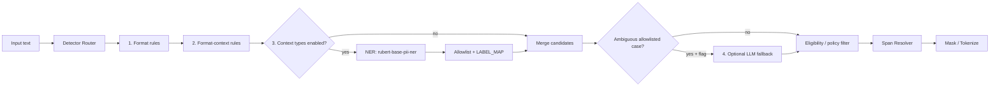

# PII Detection Architecture & Requirements

## Статус

**Назначение:** требования к слою обнаружения персональных данных и его интеграции в общую архитектуру сервиса.

**Цель:** зафиксировать финальный маппинг `тип ПД → группа → primary approach`, конкретную ML-модель, rule-based спецификации, единый detector contract и структуру кода в репозитории.

Документ не меняет внешний контракт `POST /process`, state machine, маскирование/демаскирование и protected state. Он определяет только внутренний detection pipeline.

---

## 1. Архитектурный вывод

Базовая архитектура сервиса сохраняется: `/process` и Demo Proxy используют общее PII Core; state machine отвечает за retries и round-trip; detector'ы возвращают spans; resolver устраняет пересечения; masker/restorer не зависят от конкретного способа детекции.

Финальный выбор подходов:

| Группа | Primary approach |
|---|---|
| Форматно-определяемые | **Rule-based** (в репо) |
| Контекстно-определяемые | **ML NER** = `redmadrobot-rnd/rubert-base-pii-ner` (локальный сервис) |
| Форматно-контекстные | **Rule-based как база**; LLM fallback только опционально |

**Ключевой принцип:** модель не определяет policy. ML говорит «символы 10–22 — LAST_NAME»; наш PII Engine решает, считать ли это ПД, как классифицировать и маскировать ли.

```text
ML = detector
наш код = decision maker
```

### Почему это совместимо

1. Rules дают точные offsets и детерминизм для форматов/документных реквизитов.
2. NER решает контекстные сущности (прежде всего ФИО).
3. Оба слоя сводятся к `type/start/end/score/detector` → resolver/masker не знают источник.
4. Hugging Face нужен **только чтобы скачать веса**. Текст пользователей наружу не уходит; инференс локальный в backend/container.
5. DeepSeek в Kilo Code — инструмент разработки, не production NER.

### Доказательство комбинированного пайплайна

Авторы `rubert-base-pii-ner` на своём benchmark:

| Pipeline | F1 |
|---|---|
| Чистая модель | 83.6% |
| **Rules + model** | **88.9%** |

Источник: [model card](https://huggingface.co/redmadrobot-rnd/rubert-base-pii-ner). Наш выбор «не всё через нейронку» рационален.

---

## 2. End-to-end схема (Alfa LLM Proxy)

```text
User request
     ↓
Alfa LLM Proxy
     ↓
┌──────────────────────────┐
│ PII Detection Layer      │
│                          │
│ 1. Rule-based            │
│    email / phone / INN   │
│    card / address / ...  │
│                          │
│ 2. ML NER Service        │
│    ФИО / contextual PII  │
│    (RuBERT, local)       │
└──────────────────────────┘
     ↓
 объединяем spans (resolver)
     ↓
 masking / tokenization
     ↓
 <PERSON_1>, <PHONE_1>...
     ↓
 LLM
```

Физическое разделение (high-load):

```text
┌─────────────────────┐
│ LLM Proxy /         │
│ PII Orchestrator    │
└──────────┬──────────┘
           │ HTTP/gRPC
           ↓
┌─────────────────────┐
│ NER Service         │
│ RuBERT loaded once  │
│ ~0.2B params in RAM │
└─────────────────────┘
```

Модель ~0.2B параметров — отдельный ML-компонент. Не держать RuBERT в каждой реплике proxy: иначе lifecycle API смешивается с lifecycle inference.

Полный PII Engine:

```text
                    PII ENGINE

             ┌────── incoming text ──────┐
             │                           │
             ↓                           ↓
       Rule detector                NER service
       regex/checksum                RuBERT
             │                           │
             ↓                           ↓
       EMAIL PHONE                  PERSON ...
       INN CARD / ADDR / ...            │
             │                           │
             └───────────┬───────────────┘
                         ↓
                   span resolver
                         ↓
                      masker
                         ↓
                    safe prompt
                         ↓
                        LLM
```

---

## 3. Финальный маппинг групп

| Группа | Типы ПД | Primary approach | Реализация |
|---|---|---|---|
| **Форматно-определяемые** | Email, телефон, ИНН, номер карты | **Rule-based** | `app/pii/rules/*.py` — regex + validators |
| **Контекстно-определяемые** | ФИО, место рождения, гражданство, орган выдачи, имя держателя карты | **ML NER** | `redmadrobot-rnd/rubert-base-pii-ner` + allowlist + mapper |
| **Форматно-контекстные** | Адрес, дата рождения, паспорт, код подразделения, дата выдачи, ВУ, CVV, PIN | **Rule-based база** | candidate + context/hotword/exclusion; optional LLM fallback |

**Адрес — форматно-контекстный, primary = rules** (не NER), даже если модель умеет STREET/CITY/HOUSE.

### Policy vs возможности модели

Модель умеет много labels (FIRST_NAME, EMAIL, PHONE, PASSPORT, INN, CREDIT_CARD, STREET…). **Мы не ломаем архитектуру из‑за этого.**

MVP allowlist для ML (только то, что отдаём NER по policy):

```python
ML_ALLOWED_TYPES = {
    "FIRST_NAME",
    "LAST_NAME",
    "MIDDLE_NAME",
}
```

Дальше mapper склеивает в canonical `PERSON`. Остальное из ML **отбрасываем** — эти типы закрывают rules.

Позже: добавить label в allowlist / `LABEL_MAP` без смены `/detect` API.

---

## 4. Detection pipeline



Порядок в коде:

```python
def detect_pii(text):
    rule_entities = rule_detector.detect(text)

    ml_raw = ner_model.predict(text)
    ml_entities = [
        mapped
        for entity in ml_raw
        if (mapped := map_entity(entity)) is not None
    ]

    entities = rule_entities + ml_entities
    entities = resolve_overlaps(entities)
    return entities
```

Правила исполнения:

- Router запускает только типы, включённые policy.
- Format / format-context rules — локально в orchestrator.
- NER вызывается **только если** нужны контекстные типы.
- После ML — allowlist + mapper; чужие labels модели игнорируются.
- LLM fallback выключен по умолчанию.
- Затем eligibility filter → resolver → masker.

---

## 5. Единый detector contract

```json
{
  "type": "EMAIL",
  "start": 31,
  "end": 48,
  "score": 0.99,
  "detector": "email_rule_v1"
}
```

Обязательные поля: `type`, `start`, `end` (offsets в **исходной** строке), `score`, `detector`.

`score` разных семейств **не сравнивается** как одна вероятность. Threshold — per detector/type.

### NER service HTTP

```http
POST /detect
Content-Type: application/json

{
  "text": "Меня зовут Иван Петров"
}
```

```json
{
  "entities": [
    {
      "type": "PERSON",
      "start": 11,
      "end": 22,
      "score": 0.98,
      "detector": "ml"
    }
  ]
}
```

Raw text/PII в logs NER **не пишется**.

---

## 6. ML: `redmadrobot-rnd/rubert-base-pii-ner`

### 6.1. Почему эта модель

- RuBERT, **специально дообученный** под российские ПД.
- 17 137 русскоязычных предложений, **21 тип** сущностей.
- Распознаёт ФИО, адреса, паспорт, ИНН, СНИЛС, карты и др.
- Для хакатона **не нужно обучать** свою модель: скачали веса → обернули сервисом → allowlist → измеряем.

Model card: https://huggingface.co/redmadrobot-rnd/rubert-base-pii-ner

Token-classification pipeline: https://huggingface.co/docs/transformers/main/tasks/token_classification

### 6.2. Labels модели (из model card)

```text
FIRST_NAME, LAST_NAME, MIDDLE_NAME
COUNTRY, REGION, DISTRICT, CITY, STREET, HOUSE
EMAIL, PHONE, URL, IP_ADDRESS
PASSPORT, INN, SNILS, OMS, CREDIT_CARD, DRIVER_LICENSE
...
```

### 6.3. Что мы реально используем в MVP

| Наш canonical type | Откуда | Labels модели |
|---|---|---|
| PERSON (ФИО) | **ML** | FIRST_NAME + LAST_NAME + MIDDLE_NAME → merge |
| PLACE_OF_BIRTH | ML + role/context *или* later fine-tune | CITY/… + контекст «родился» |
| CITIZENSHIP | ML + role/context | COUNTRY + контекст гражданства |
| PASSPORT_ISSUER | ML + role/context | org-like + контекст выдачи |
| CARDHOLDER_NAME | ML + card context | FIRST/LAST + карточный контекст |
| EMAIL, PHONE, INN, CARD | **Rules** | ML labels игнорируем |
| ADDRESS, PASSPORT#, CVV… | **Rules** | ML labels игнорируем |

MVP-минимум: allowlist только name-parts → `PERSON`. Остальные контекстные типы — role adapter поверх spans / контекстных окон; при слабом качестве — fine-tune labels без смены API.

### 6.4. Код модели

`app/pii/ner/model.py`:

```python
from transformers import pipeline


class PiiNerModel:
    def __init__(self):
        self.model = pipeline(
            "token-classification",
            model="redmadrobot-rnd/rubert-base-pii-ner",
            aggregation_strategy="simple",
        )

    def predict(self, text: str):
        return self.model(text)
```

Минимальный detect:

```python
from transformers import pipeline

ner = pipeline(
    "token-classification",
    model="redmadrobot-rnd/rubert-base-pii-ner",
    aggregation_strategy="simple",
)

def detect(text: str):
    entities = ner(text)
    return [
        {
            "type": entity["entity_group"],
            "start": entity["start"],
            "end": entity["end"],
            "score": float(entity["score"]),
            "detector": "ml",
        }
        for entity in entities
    ]
```

Пример входа: `Меня зовут Иван Петров, я живу в Москве.`

Сырой ML-ответ (условно):

```json
[
  {"type": "FIRST_NAME", "start": 11, "end": 15, "score": 0.98, "detector": "ml"},
  {"type": "LAST_NAME", "start": 16, "end": 22, "score": 0.99, "detector": "ml"}
]
```

После mapper:

```json
[
  {"type": "PERSON", "start": 11, "end": 22, "score": 0.98, "detector": "ml"}
]
```

Masking: `Меня зовут <PERSON_1>, я живу в Москве.`

### 6.5. Mapper + allowlist

`app/pii/ner/mapper.py`:

```python
LABEL_MAP = {
    "FIRST_NAME": "PERSON",
    "LAST_NAME": "PERSON",
    "MIDDLE_NAME": "PERSON",
}


def map_entity(entity):
    label = entity["entity_group"]
    if label not in LABEL_MAP:
        return None
    return {
        "type": LABEL_MAP[label],
        "start": entity["start"],
        "end": entity["end"],
        "score": float(entity["score"]),
        "detector": "ml",
    }
```

Соседние PERSON-фрагменты (Иван + Петров) **обязательно merge** в один span (см. §8): авторы модели предупреждают, что после `aggregation_strategy="simple"` нужен дополнительный merge.

### 6.6. Runtime NER service

- Веса скачиваются при сборке образа / старте; runtime **без** исходящих вызовов HF на user text.
- Модель грузится **один раз** в RAM.
- Health/readiness endpoints.
- Timeout со стороны orchestrator.
- Model id/version в metadata (`redmadrobot-rnd/rubert-base-pii-ner@<revision>`).
- При недоступности NER и включённых контекстных типах → **fail closed**.
- Thresholds версионируются.

### 6.7. Fine-tuning позже

Если holdout покажет: ФИО ок, а «место рождения» / «держатель карты» плохо — дообучаем нужные labels. **`POST /detect` и backend не меняются.**

---

## 7. Chunking длинных текстов

У модели лимит последовательности. Авторы рекомендуют sliding window:

- `max_length=512`
- `stride=128`
- NER по каждому chunk
- пересчёт offsets в глобальные
- merge duplicates / fragments на границах

```text
текст 1500 токенов
      ↓
[0........511]
       [384........895]
              [768........1279]
                     [...]
      ↓
NER каждого chunk
      ↓
пересчитываем offsets
      ↓
merge duplicates / fragments
      ↓
готовые spans
```

Обязательный тест: сущность, пересекающая границу chunk.

---

## 8. Span merge / resolver

После rules + ML:

1. Merge соседних name-parts → один `PERSON`.
2. Дедуп одинаковых spans.
3. Overlaps по таблице приоритетов (специфичный тип > общий).
4. Один символ исходной строки — не более одного masking.

---

## 9. Rule-based: что конкретно продумать

### 9.1. Общий контракт rule-detector

Каждый rule-файл экспортирует:

```python
def detect(text: str) -> list[Finding]:
    ...
```

Цепочка format-типов:

```text
candidate pattern/parser
→ normalize copy for validation
→ validator / checksum
→ exact source offsets (не нормализованные!)
→ Finding(type, start, end, score, detector)
```

Цепочка format-context:

```text
candidate extraction
→ positive hotwords / anchors (proximity window)
→ negative / exclusion terms
→ optional linked findings
→ Finding + reason_code (без raw PII в логах)
```

Общие требования:

- patterns компилируются при старте;
- исходная строка не мутируется;
- version id у каждого rule (`email_rule_v1`);
- маскирование **не** внутри detector;
- unit tests: positive / variant / hard negative.

Ориентиры: [Presidio PatternRecognizer](https://microsoft.github.io/presidio/analyzer/), [Google SDP hotword/exclusion](https://docs.cloud.google.com/sensitive-data-protection/docs/creating-custom-infotypes-rules), [Yargy](https://github.com/natasha/yargy) для русских грамматик.

---

### 9.2. Форматно-определяемые — спецификация

#### Email — `rules/email.py`

| Что | Детали |
|---|---|
| Candidate | Regex local@domain (Unicode/IDN — решить явно; минимум ASCII + кириллица в display — только если в ТЗ) |
| Validate | Синтаксис RFC-lite: одна `@`, допустимые символы, длина local/domain |
| Span | Exact match в исходнике |
| Hard negative | `support@bank.ru`, `noreply@…`, домены из service allowlist |
| Score | 0.99 если validation ok |
| Detector id | `email_rule_v1` |

#### Phone — `rules/phone.py`

| Что | Детали |
|---|---|
| Candidate | Parser, не один regex: `+7`, `8`, скобки, пробелы, дефисы |
| Normalize | Только копия → цифры для валидации |
| Validate | Длина под RU (10 digits national / 11 with country); конфиг региона |
| Span | Полный исходный фрагмент включая `+` и разделители |
| Hard negative | Телефон колл-центра / горячей линии из allowlist |
| Detector id | `phone_rule_v1` |

#### ИНН — `rules/inn.py`

| Что | Детали |
|---|---|
| Candidate | 12 цифр (физлицо); опционально 10 для юрлиц — **выключить**, если ТЗ только ФЛ |
| Validate | Контрольные цифры ИНН (два checksum для 12-значного) |
| Span | Исходные 12 символов (с пробелами/дефисами — если допускаем в candidate, span = как в тексте) |
| Hard negative | «номер договора» той же длины **без** слова ИНН — для format-типа обычно берем checksum; policy может требовать контекст |
| Detector id | `inn_rule_v1` |

#### Карта — `rules/card.py`

| Что | Детали |
|---|---|
| Candidate | 13–19 цифр с пробелами/дефисами |
| Normalize | Только digits |
| Validate | **Luhn**; опционально BIN ranges |
| Span | Исходный фрагмент с разделителями |
| Hard negative | Случайные длинные числа, не проходящие Luhn; «идентификатор операции» |
| Detector id | `card_rule_v1` |

---

### 9.3. Форматно-контекстные — спецификация

Общий proximity: окно **±40–80 символов** (конфиг) вокруг candidate; hotwords регистронезависимы.

#### Адрес — `rules/address.py` (**не NER**)

| Что | Детали |
|---|---|
| Подход | Grammar/parser по компонентам (Yargy-style), не giant-regex |
| Компоненты | индекс, город/посёлок, улица/пр/пер, дом, корпус, квартира + маркеры `г.`, `ул.`, `д.`, `кв.` |
| Positive | Комбинация ≥ N компонентов (конфиг: например улица+дом или город+улица) |
| Negative | `отделение Банка`, `офис`, `филиал`, `адрес банка` |
| Partial | Частичный адрес — да, если компонентная комбинация достаточна |
| Detector id | `address_rule_v1` |

#### Дата рождения — `rules/dates.py` (тип `BIRTH_DATE`)

| Что | Детали |
|---|---|
| Candidate | Date parser: `ДД.ММ.ГГГГ`, `ДД/ММ/ГГГГ`, текстовые месяцы |
| Context+ | `дата рождения`, `родился`, `родилась`, `ДР` |
| Context− | `дата заседания`, `опубликован`, `срок` |
| Detector id | `birth_date_rule_v1` |

#### Серия и номер паспорта — `rules/passport.py`

| Что | Детали |
|---|---|
| Candidate | `СССС НННННН` / слитно 10 цифр; слова `серия`, `номер` |
| Context+ | `паспорт`, `серия`, `номер паспорта` |
| Context− | `номер заказа`, `заявка` |
| Span | Фактически найденный реквизит (серия+номер как один span, если рядом) |
| Detector id | `passport_rule_v1` |

#### Код подразделения — `rules/subdivision_code.py`

| Что | Детали |
|---|---|
| Candidate | `NNN-NNN` |
| Context+ | **обязательно** `код подразделения` / `подразделен` |
| Context− | одиночный `XXX-XXX` в справочнике без якоря |
| Detector id | `subdivision_code_rule_v1` |

#### Дата выдачи паспорта — `rules/dates.py` (тип `PASSPORT_ISSUE_DATE`)

| Что | Детали |
|---|---|
| Candidate | тот же date parser |
| Context+ | `выдан`, `дата выдачи` + связь с паспортом/документом |
| Context− | обычная дата публикации |
| Detector id | `passport_issue_date_rule_v1` |

#### ВУ — `rules/driver_license.py`

| Что | Детали |
|---|---|
| Candidate | серия/номер паттерн ВУ |
| Context+ | `водительское`, `удостоверение`, `ВУ`, `права` |
| Context− | `номер заявки` |
| Detector id | `driver_license_rule_v1` |

#### CVV — `rules/cvv.py`

| Что | Детали |
|---|---|
| Candidate | 3–4 цифры |
| Context+ | `CVV`, `CVC`, `CVV2` рядом |
| Context− | `код офиса`, любые 3 цифры без якоря |
| Detector id | `cvv_rule_v1` |

#### PIN — `rules/pin.py`

| Что | Детали |
|---|---|
| Candidate | 4–6 цифр |
| Context+ | `PIN`, `ПИН`, `пин-код` + карточный контекст |
| Context− | `код двери` |
| Optional policy | требовать связанный номер карты в том же тексте |
| Detector id | `pin_rule_v1` |

---

### 9.4. Матрица «что продумать до кода» (checklist)

| Тип | Pattern/parser | Checksum | Hotwords+ | Hotwords− | Merge spans | Fixtures ± |
|---|---|---|---|---|---|---|
| Email | ✓ | syntax | — | service domains | — | ✓ |
| Phone | ✓ parser | length/region | — | call-center list | — | ✓ |
| INN | ✓ | контрольные цифры | optional | contract# | — | ✓ |
| Card | ✓ | Luhn | — | non-Luhn IDs | — | ✓ |
| Address | grammar | — | ул/д/кв | банк/офис | компоненты→1+ spans | ✓ |
| Birth date | date | — | родился | заседание | — | ✓ |
| Passport | series+no | — | паспорт | заказ | series+no | ✓ |
| Subdivision | NNN-NNN | — | код подр. | голый XXX-XXX | — | ✓ |
| Issue date | date | — | выдан | опубликован | — | ✓ |
| VU | series+no | — | ВУ/права | заявка | — | ✓ |
| CVV | 3–4 dig | — | CVV/CVC | код офиса | — | ✓ |
| PIN | 4–6 dig | — | PIN | код двери | — | ✓ |
| PERSON | — (ML) | — | — | публичная персона (eligibility) | FIRST+LAST+MID | ✓ |

---

## 10. Матрица `тип → группа → подход → реализация`

| Тип ПД | Группа | Primary | Реализация |
|---|---|---|---|
| ФИО | Контекст | **ML** | RuBERT allowlist name-parts → `PERSON` + merge |
| Место рождения | Контекст | **ML + role** | spans + контекст рождения; иначе fine-tune later |
| Гражданство | Контекст | **ML + role** | COUNTRY + контекст гражданства |
| Орган выдачи | Контекст | **ML + role** | org-span + контекст выдачи паспорта |
| Имя держателя карты | Контекст | **ML + role** | PERSON + карточный контекст |
| Адрес | Format-context | **Rules** | grammar/components + exclusions |
| Дата рождения | Format-context | **Rules** | date + birth hotwords |
| Серия/номер паспорта | Format-context | **Rules** | pattern + passport context |
| Код подразделения | Format-context | **Rules** | NNN-NNN + якорь |
| Дата выдачи | Format-context | **Rules** | date + «выдан» |
| Серия/номер ВУ | Format-context | **Rules** | pattern + VU context |
| CVV | Format-context | **Rules** | digits + CVV anchor |
| PIN | Format-context | **Rules** | digits + PIN/card context |
| Email | Format | **Rules** | regex + syntax |
| Телефон | Format | **Rules** | parser + validate |
| ИНН | Format | **Rules** | 12 dig + checksum |
| Карта | Format | **Rules** | digits + Luhn |

---

## 11. Optional LLM fallback

Не primary. Только если:

- feature flag on;
- тип в узком allowlist format-context;
- rules уже дали ambiguous candidate;
- LLM в защищённом контуре;
- timeout + structured schema + exact span;
- unknown labels отклоняются.

Не нужен для прохождения базового `/process`.

---

## 12. Eligibility / policy filter

После merge — не четвёртый detector. Учитывает:

- public/service allowlist consumer;
- negative context;
- связанные типы;
- policy.

Hard negatives:

- `Александр Пушкин — русский поэт`;
- адрес отделения Банка;
- служебный email / телефон колл-центра;
- обычная дата;
- голый `XXX-XXX`;
- 3–4 цифры без CVV/PIN.

---

## 13. Структура репозитория

```text
app/
│
├── pii/
│   ├── rules/
│   │   ├── email.py
│   │   ├── phone.py
│   │   ├── inn.py
│   │   ├── card.py
│   │   ├── address.py
│   │   ├── dates.py
│   │   ├── passport.py
│   │   ├── subdivision_code.py
│   │   ├── driver_license.py
│   │   ├── cvv.py
│   │   ├── pin.py
│   │   ├── context_rules.py
│   │   └── exclusions.py
│   │
│   ├── ner/
│   │   ├── model.py          # pipeline rubert-base-pii-ner
│   │   ├── mapper.py         # LABEL_MAP + PERSON merge
│   │   ├── chunking.py       # 512 / stride 128
│   │   ├── client.py         # HTTP client → NER service
│   │   └── service.py        # orchestrator glue / local mode
│   │
│   ├── resolver.py
│   ├── masker.py
│   ├── eligibility.py
│   └── pipeline.py
│
├── policies/
│   ├── pii_types.yaml
│   ├── detector_routes.yaml
│   ├── ml_allowlist.yaml
│   ├── overlap_priorities.yaml
│   └── consumer_policies.yaml
```

Отдельный deployable NER (рекомендуется):

```text
services/
  ner/
    app.py                 # FastAPI POST /detect
    model.py
    mapper.py
    chunking.py
    requirements.txt       # transformers, torch, ...
    Dockerfile             # download weights at build
```

---

## 14. Тесты

### На каждый из 17 типов

- simple positive; variant positive; hard negative;
- mixed register; несколько ПД в строке; overlap;
- round-trip mask→demask; нет raw PII в logs.

### Rules

- invalid checksum/Luhn;
- формат без нужного контекста (format-context);
- address полный/частичный + адрес банка;
- CVV/PIN без якоря.

### NER

- reachable/unreachable → fail closed;
- offsets exact;
- allowlist отбрасывает EMAIL/PHONE из модели;
- FIRST+LAST merge → один PERSON;
- публичная персона → eligibility reject;
- chunk boundary;
- смена revision модели без смены client contract.

---

## 15. Definition of Done

- [ ] На каждый тип ПД есть detector нужного класса
- [ ] Format/format-context: rules в repo + ± fixtures
- [ ] Context: NER service на `redmadrobot-rnd/rubert-base-pii-ner`, локальный инференс
- [ ] HF только download weights; user text не уходит наружу
- [ ] ML allowlist + LABEL_MAP; модель не задаёт policy
- [ ] PERSON merge name-parts; chunking 512/128
- [ ] LLM не в hot path по умолчанию
- [ ] ADDRESS в format-context, primary = rules
- [ ] Findings: `type/start/end/score/detector`
- [ ] Model/rule versions в metadata
- [ ] Overlaps детерминированы; fail closed без NER когда нужен
- [ ] Замена/fine-tune модели без смены `/detect` и `/process`

---

## 16. MVP-план на хакатон

1. Скачать `redmadrobot-rnd/rubert-base-pii-ner` в образ.
2. Поднять `POST /detect` с chunking + mapper allowlist → PERSON.
3. Подключить format rules (email/phone/INN/card).
4. Подключить format-context rules (address, dates, passport, CVV, PIN…).
5. Resolver + masker.
6. Замерить precision/recall/latency на 17 категориях.
7. Fine-tune только если конкретные контекстные классы просели — API не трогаем.

---

## 17. Источники

- Model: https://huggingface.co/redmadrobot-rnd/rubert-base-pii-ner  
- Token classification: https://huggingface.co/docs/transformers/main/tasks/token_classification  
- Presidio Analyzer: https://microsoft.github.io/presidio/analyzer/  
- Google SDP custom infoTypes / hotwords: https://docs.cloud.google.com/sensitive-data-protection/docs/creating-custom-infotypes-rules  
- Yargy: https://github.com/natasha/yargy  

---

## 18. Итог

```text
format          → rules в репо
context         → локальный RuBERT PII NER + allowlist/mapper
format-context  → rules (+ optional LLM fallback)
```

Один contract spans → один resolver → masking. Модель — detector; policy и маскирование — наш код.
