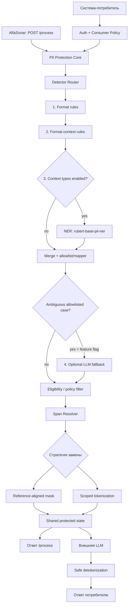
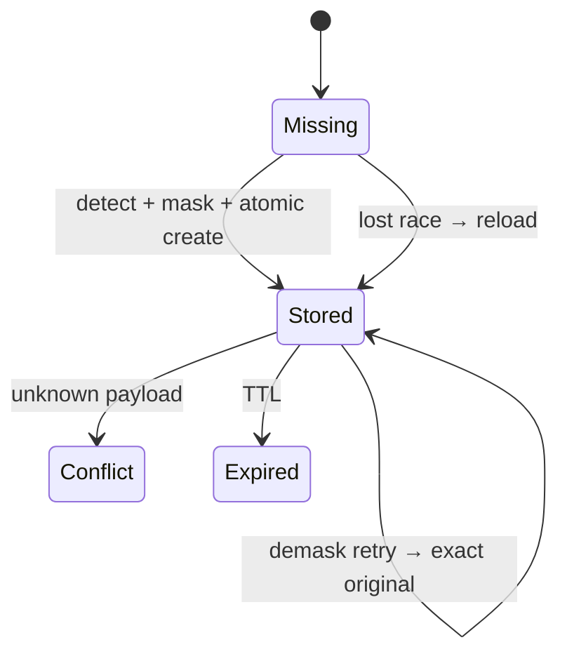
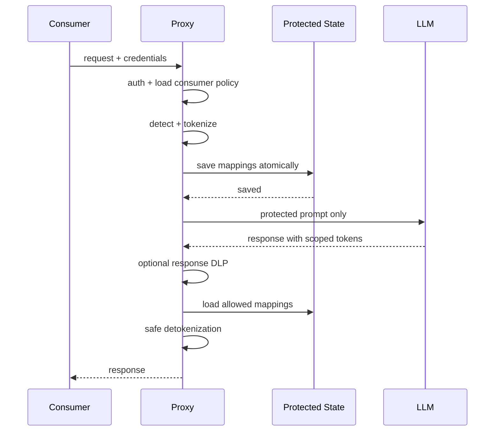

# Финальный архитектурный артефакт

## Модуль безопасности персональных данных для AlfaGen

**Статус:** архитектурная версия для реализации и обсуждения с ментором  
**Цель:** пройти обязательный автотест `/process` и показать живой proxy-сценарий «система-потребитель → защита ПД → LLM → безопасный ответ».

---

## 1. Что именно мы строим

Сервис находит персональные данные в тексте, заменяет их безопасным представлением, не передаёт исходные значения во внешнюю LLM и при разрешённом сценарии восстанавливает значения обратно.

У сервиса два независимых входа к общему ядру:

1. **`POST /process` для AlfaSonar** — обязательный контракт автоматической проверки. Здесь нет `system_id`, API-ключа или вызова LLM. Первый запрос с новым `payload_id` маскируется, запрос с возвращённой маской и тем же ID демаскируется.
2. **Demo Proxy API** — живой сценарий для жюри. Здесь проверяются система-потребитель, её политика, разрешённые типы ПД и право на демаскирование, после чего защищённый запрос направляется в LLM.

Оба входа используют одно ядро обнаружения ПД, но разные стратегии замены:

- `/process` использует **эталонно-совместимое маскирование**, максимально близкое к правилам и примерам задания;
- Proxy использует **токенизацию уникальными токенами**, чтобы LLM могла переставлять фрагменты текста без потери возможности безопасного восстановления.



Proxy / high-load разделение:

```text
User request → Alfa LLM Proxy / PII Orchestrator
                    │
                    ├─ Rule-based (email/phone/INN/card/address/…)
                    │
                    └─ HTTP → NER Service (RuBERT in RAM once)
                              redmadrobot-rnd/rubert-base-pii-ner
                    ↓
              merge spans → mask → LLM
```

Hugging Face используется **только для скачивания весов** при сборке/старте. User text в HF не отправляется; инференс локальный.

---

## 2. Граница обязательного контракта `/process`

### Запрос и ответ

```http
POST /process
Content-Type: application/json

{
  "payload": "<строка>",
  "payload_id": "<идентификатор>"
}
```

Успешный ответ:

```json
{
  "result": "<строка>"
}
```

В обязательный контракт **не добавляем** `system_id`, API-key, режим `mask/demask` или другие обязательные поля: автотестер их не отправляет.

### Поведение

| Ситуация | Результат |
|---|---|
| Новый `payload_id`, исходный текст | Находим ПД, создаём маску, атомарно сохраняем состояние, возвращаем маску |
| Тот же ID и тот же исходный текст | Считаем retry прямого запроса, возвращаем точно ту же маску |
| Тот же ID и ранее возвращённая маска | Восстанавливаем точный исходный текст |
| Повтор запроса с той же маской | Считаем retry обратного запроса, снова возвращаем исходный текст |
| Новый ID, но ПД не найдены | Возвращаем текст без изменений и сохраняем состояние операции |
| Тот же ID и посторонний payload | Возвращаем понятный `409 Conflict` |
| Перегрузка | Допустим `429` с `Retry-After` |
| Недоступно хранилище состояния | `503`; исходный текст никуда дальше не отправляется |

`payload_id` — только ключ корреляции пары «маскирование → демаскирование». Он не является ключом доступа и сам по себе не даёт права раскрывать ПД.

---

## 3. Надёжная state machine `/process`

### Ключ состояния

```text
autotest:{payload_id}
```

Для Demo Proxy пространство ключей другое:

```text
proxy:{consumer_id}:{operation_id}
```

Это не позволяет смешать состояние автотеста и proxy, а в proxy — данные разных потребителей.

### Алгоритм

```text
1. Вычислить HMAC(payload) серверным секретом.

2. Если state уже существует:
   a. HMAC совпал с original_fingerprint
      → retry маскирования
      → вернуть сохранённый masked_result.

   b. HMAC совпал с masked_fingerprint
      → демаскирование или его retry
      → точно восстановить original и вернуть его.

   c. Иначе
      → вернуть 409 Conflict.

3. Если state отсутствует:
   a. detection pipeline → eligibility/policy filter → resolve overlaps → mask;
   b. подготовить state;
   c. создать state атомарно через SET NX / CAS;
   d. если запись создана — вернуть masked_result;
   e. если другой worker успел первым — перечитать state и выполнить пункт 2.
```

Атомарная запись обязательна: при двух одновременных запросах с одним `payload_id` оба worker'а должны вернуть одинаковый результат, соответствующий одной сохранённой операции.



---

## 4. Что хранится для операции

| Поле | Зачем |
|---|---|
| Namespace и идентификатор операции | Изоляция автотеста и proxy; поиск состояния |
| `consumer_id` — только для proxy | Изоляция разных систем-потребителей |
| `original_fingerprint` | Узнать retry исходного запроса без сравнения открытого текста |
| `masked_fingerprint` | Узнать запрос на демаскирование или его retry |
| `masked_result` | Вернуть строго тот же результат при retry |
| Зашифрованные значения замен | Точно восстановить ПД |
| Позиции замен в маске `/process` | Собрать исходную строку без изменения пробелов и пунктуации |
| Выпущенные токены в proxy | Восстановить только токены, созданные сервисом в этой операции |
| Версия правил и стратегии | Не сломать восстановление после изменения конфигурации |
| `created_at` и TTL | Не хранить состояние бесконечно |

Полный исходный текст отдельно не дублируется, если он точно восстанавливается из маски и зашифрованных соответствий. При этом mappings всё равно считаются чувствительными данными: они шифруются и удаляются по TTL.

Для сравнения повторов используется **HMAC**, а не обычный SHA-256: простой хеш предсказуемых значений можно перебирать.

TTL должен покрывать весь прогон, очередь и retries. Конкретное значение задаётся конфигурацией после ответа организаторов; до уточнения выбирается запас, достаточный для прогона длительностью около пяти минут и повторных запросов.

---

## 5. Детектирование ПД: финальный выбор подходов

Подробные требования, rule-спеки и код — в `PII_DETECTION_ARCHITECTURE.md`. Здесь — архитектурная фиксация, согласованная с ним.

### 5.1. Финальный маппинг

| Группа | Типы ПД | Primary approach | Что реализуем |
|---|---|---|---|
| **Форматно-определяемые** | Email, телефон, ИНН, номер карты | **Rule-based** | `app/pii/rules/`: regex/parser + syntax/Luhn/ИНН checksum |
| **Контекстно-определяемые** | ФИО (+ role-типы: место рождения, гражданство, орган, держатель карты) | **ML NER** | Отдельный сервис: **`redmadrobot-rnd/rubert-base-pii-ner`**, локальный инференс |
| **Форматно-контекстные** | Адрес, даты, паспорт/ВУ, код подразделения, CVV, PIN | **Rule-based база** | Candidate + hotword/exclusion; optional LLM fallback |

**Адрес — format-context, primary = rules** (не NER), даже если модель умеет STREET/CITY/HOUSE.

### 5.2. Конкретная ML-модель

- Модель: [`redmadrobot-rnd/rubert-base-pii-ner`](https://huggingface.co/redmadrobot-rnd/rubert-base-pii-ner) — RuBERT под российские ПД (~0.2B, 21 entity type).
- HF = только download weights. User text наружу не уходит.
- MVP allowlist ML: `FIRST_NAME` / `LAST_NAME` / `MIDDLE_NAME` → merge в canonical `PERSON`.
- Остальные labels модели (EMAIL, PHONE, INN, CARD, PASSPORT…) **игнорируем** — их закрывают rules. Модель не задаёт policy.
- Авторы benchmark: pure ML F1 83.6% vs **rules+model 88.9%** → комбинированный пайплайн оправдан.
- Chunking: `max_length=512`, `stride=128`, затем merge fragments (рекомендация model card).
- Fine-tune позже без смены `POST /detect`.

### 5.3. Почему это согласуется с общей архитектурой

- Единый span contract → resolver/masking/state не зависят от Rule vs ML.
- Rules в orchestrator; NER — отдельный process/container (не в каждой реплике proxy).
- DeepSeek/Kilo — только разработка, не runtime detector.
- LLM fallback выключен по умолчанию.

### 5.4. Порядок detection pipeline

```text
1. Format rules          (email, phone, INN, card)
2. Format-context rules  (address, dates, passport, CVV, PIN, …)
3. Context gate → NER service (RuBERT), если нужны контекстные типы
4. Allowlist + LABEL_MAP + PERSON merge
5. Merge all candidates
6. Optional LLM fallback — ambiguous allowlisted format-context only
7. Eligibility / policy filter
8. Span Resolver
9. MaskStrategy
```

### 5.5. Единый contract findings

```json
{
  "type": "PERSON",
  "start": 11,
  "end": 22,
  "score": 0.98,
  "detector": "ml"
}
```

NER: внутренний `POST /detect` → `{ "entities": [ ... ] }`. Raw PII в logs нет.

### 5.6. Rule-based (кратко; детали в PII-доке)

| Тип | Минимум реализации |
|---|---|
| Email | regex + syntax validation; exclude service domains |
| Phone | parser (`+7`/разделители) + length/region; exclude call-center |
| INN | 12 digits + контрольные цифры |
| Card | digits + **Luhn** |
| Address | component grammar (ул/д/кв), не giant-regex; exclude «отделение Банка» |
| Birth/issue dates | date parser + hotwords (`родился` / `выдан`) |
| Passport / VU / subdivision | pattern + обязательный документный якорь |
| CVV / PIN | короткие цифры **только** с якорем CVV/PIN |

Цепочки: format = `candidate → validate → exact span`; format-context = `candidate → ±context → span`.

### 5.7. NER service

```text
transformers pipeline(token-classification)
  model=redmadrobot-rnd/rubert-base-pii-ner
  aggregation_strategy=simple
→ allowlist name-parts → LABEL_MAP → PERSON
→ chunk 512/stride 128 → global offsets → merge
```

Role-типы (место рождения, гражданство, орган, держатель карты): context window / later fine-tune; API тот же.

Fail closed, если NER недоступен и контекстные типы включены.

### 5.8. Optional LLM fallback

Только feature flag + узкий allowlist format-context + уже ambiguous rule-candidate + timeout + structured span. Не нужен для базового `/process`.

### 5.9. Eligibility и overlaps

Hard negatives: публичная персона, адрес банка, service email/телефон, обычная дата, голый `XXX-XXX`, цифры без CVV/PIN.

Resolver: дедуп, приоритеты, один символ — одна маска; соседние name-parts → один `PERSON`.

---

## 6. Две стратегии защиты текста

### 6.1. Для `/process`: reference-aligned masking

Автотестер сравнивает результат с эталонной маской, поэтому здесь нельзя без проверки везде подставлять `[PERSON_1]` или другой произвольный формат.

Требования к стратегии:

- соответствовать правилам маскирования для каждого типа из задания;
- сохранять незаменённые символы, пробелы, регистр и пунктуацию;
- быть детерминированной;
- обеспечивать точное обратное восстановление через сохранённое состояние;
- обрабатывать строку линейно по отсортированным spans, без цепочки `.replace()`.

Точный формат масок сверяется с организаторами и пробным прогоном. До подтверждения формат масок считается открытым вопросом, а не архитектурным фактом.

### 6.2. Для LLM Proxy: scoped tokenization

Объясняющий пример:

```text
Напиши письмо клиенту ⟦PII_PERSON_a81f94c7⟧
на ⟦PII_EMAIL_9bd213e4⟧.
```

Свойства токена:

- уникален для конкретной операции;
- непредсказуем;
- содержит только безопасный тип, но не исходное значение;
- восстанавливается только в контексте того же `consumer_id` и операции;
- не принимается за валидный только из-за похожего внешнего вида.

Токены вида `[PERSON_1]` допустимы только для объяснения идеи. В реальной схеме они слишком предсказуемы: пользователь или LLM могут создать такой же текст и спровоцировать ошибочную подстановку.

Если LLM изменила токен до неузнаваемости, сервис не угадывает исходное значение. По политике системы возвращается ответ с невосстановленным безопасным фрагментом либо контролируемая ошибка.

---

## 7. Demo Proxy flow



Политика системы-потребителя определяет:

- разрешён ли доступ к сервису;
- какие типы ПД искать;
- какие типы маскировать;
- какую стратегию защиты использовать;
- разрешено ли демаскирование ответа;
- срок хранения состояния.

Проверка ответа LLM на новые чувствительные данные — отдельный optional response DLP, а не часть обязательного `/process`.

---

## 8. Безопасность и отказоустойчивость

Обязательные правила:

1. **Fail closed:** если detection, state storage или policy check не завершились успешно, исходный текст в LLM не отправляется.
2. Сначала сохраняем mappings, затем подтверждаем успешное маскирование или отправляем текст в LLM.
3. При потере состояния не пытаемся «угадать» исходный текст.
4. Демаскирование proxy разрешено только той системе, которой принадлежит операция, и только если это разрешено её политикой.
5. Повторное демаскирование допустимо до истечения TTL: запись не удаляется после первого чтения.
6. В логах отсутствуют исходный payload, значения ПД, mappings, секреты и API-ключи.
7. Секреты передаются через переменные окружения/secret storage и не входят в архив решения.
8. Чувствительное состояние шифруется; fingerprints строятся через HMAC с отдельным серверным секретом.
9. Ошибки API понятны клиенту, но не раскрывают внутреннее состояние и значения ПД.

### Минимальный набор кодов ответа

| Код | Когда |
|---|---|
| `200` | Успешная обработка |
| `400` | Невалидная JSON-схема или пустые обязательные поля |
| `409` | `payload_id` уже связан с другим, неизвестным payload |
| `429` | Контролируемая перегрузка; указываем `Retry-After` |
| `503` | Защитный компонент или хранилище состояния недоступны |

---

## 9. Производительность

Исходное ТЗ задаёт ориентир **RPS 1000 и latency до 1 секунды**, а критерии жюри называют целевым уровнем **latency до 0,5 секунды при RPS 1000**. Поэтому проектная цель для демонстрации — `p95 ≤ 0,5 с`, при этом обязательно показать честные фактические цифры.

Performance-path:

- stateless API workers;
- общее внешнее state storage для нескольких worker'ов;
- компилируемые один раз правила и словари;
- пакетный/единый проход detector'ов там, где возможно;
- разрешение overlaps до маскирования;
- сборка результата одним проходом по spans;
- LLM fallback выключен по умолчанию; baseline `/process` не делает LLM-вызов;
- ограничение очереди и контролируемый `429` вместо неконтролируемого падения;
- отдельный тест текста до 100 000 токенов.

Минимальные метрики:

- RPS запросов;
- latency `p50/p95/p99` по этапам и целиком;
- количество `2xx/4xx/5xx/429`;
- число найденных ПД по типам, без значений;
- state hit/miss/conflict;
- detector errors и storage errors;
- размер входа и число spans;
- для proxy отдельно — latency LLM и tokens per second.

---

## 10. Логические компоненты кода

| Компонент | Ответственность |
|---|---|
| `autotest_api` | Строгий контракт `POST /process` |
| `proxy_api` | Авторизованный запрос к LLM |
| `policy` | Настройки систем-потребителей и включённых типов ПД |
| `detector_router` | Запускает detection stages по policy |
| `format_rules` | `email/phone/inn/card`: pattern + validation/Luhn |
| `format_context_rules` | `address/dates/passport/VU/subdivision/cvv/pin`: candidate + hotword/exclusion |
| `ner_client` | HTTP/gRPC к NER service |
| `ner_service` | **`redmadrobot-rnd/rubert-base-pii-ner`**, chunking 512/128, allowlist, PERSON merge |
| `llm_fallback` | Optional, feature-flagged, только ambiguous format-context |
| `eligibility_filter` | Public/service exclusions после merge |
| `span_resolver` | Дедуп, overlaps, merge name-parts |
| `mask_strategies` | Эталонные маски и scoped-токены |
| `state_store` | Atomic create, TTL, защита состояния |
| `restorer` | Точное восстановление `/process` и proxy tokens |
| `llm_client` | Только защищённый prompt во внешнюю LLM |
| `observability` | Безопасные логи, метрики, trace-id |

Структура detector-кода (см. PII-док):

```text
app/pii/
  rules/     email.py phone.py inn.py card.py address.py …
  ner/       model.py mapper.py chunking.py client.py service.py
  resolver.py masker.py eligibility.py pipeline.py
services/ner/   # отдельный container: FastAPI POST /detect + RuBERT
```

Все findings = `type/start/end/score/detector`. Смена revision модели / fine-tune не трогает `/process`, state, masker.

---

## 11. Контрактные тесты до интеграции с LLM

### P0 — обязательно

| Тест | Ожидаемый результат |
|---|---|
| Новый ID → исходный текст | Возвращена маска, state сохранён |
| Тот же ID → возвращённая маска | Возвращён исходный текст byte-to-byte |
| Retry исходного запроса | Возвращена та же маска |
| Retry маски | Возвращён тот же оригинал |
| Два одновременных исходных запроса с одним ID | Одинаковый результат, одно согласованное state |
| Тот же ID + неизвестный payload | `409` |
| Текст без ПД | Round-trip без изменений |
| Несколько типов ПД и overlaps | Каждый участок заменён ровно один раз |
| Недоступен state store | `503`, утечки дальше нет |
| Проверка логов | Нет payload, значений ПД и секретов |

### P1 — оценка жюри

| Тест | Ожидаемый результат |
|---|---|
| «Александр Пушкин» как поэт | Минимум ложных срабатываний |
| Адрес отделения банка | Не определяется как адрес клиента без подтверждающего контекста |
| Разный регистр и форматы дат | Стабильное распознавание |
| «серия … номер …» | Распознаётся связанный документ |
| Текст до 100 000 токенов | Обрабатывается без падения |
| Нагрузка RPS 1000 | Показаны p50/p95/p99 и ошибки |
| LLM переставила токены | Разрешённые токены корректно восстановлены |
| LLM создала похожий токен | Чужое значение не подставлено |

---

## 12. Что в решении обязательно, а что не надо переусложнять

### Обязательно сейчас

- строгий `/process`;
- точный round-trip;
- идемпотентность с учётом retries;
- atomic state;
- максимальное покрытие типов ПД;
- низкий false positive на ловушках;
- конфигурация систем для demo proxy;
- безопасные логи и метрики;
- измеренная производительность;
- README и короткая инструкция для жюри.

### После P0, если остаётся время

- response DLP;
- синтетические данные;
- дополнительные документы кроме паспорта РФ;
- контекстные комбинации вроде «PIN + номер карты»;
- подтверждение RPS 2000;
- полноценный UI.

Production-ready инфраструктуру, сложную микросервисную декомпозицию и избыточный security theater не строим ради вида. На защите показываем только то, что реально реализовано и проверено.

---

## 13. Открытые вопросы организаторам

1. Где доступны примеры эталонных масок по типам ПД и как именно нормированное span-based расстояние оценивает допустимые варианты?
2. Нужна ли отдельная авторизация для `/process`, и как выполнить пробный прогон AlfaSonar?
3. Какой SLA считается итоговым: до 1 секунды из ТЗ или до 0,5 секунды из критериев жюри; какой перцентиль и размер запроса используются?
4. Как долго после маскирования может прийти демаскирование и сколько времени после прогона держать сервис и state?

Ответы не блокируют разработку. До них используем явно зафиксированные допущения и делаем формат масок конфигурируемым.

---

## 14. Дальнейшие шаги

### Шаг 1. Заморозить контракт и каркас — Даня

- зафиксировать DTO `{payload, payload_id} → {result}`;
- описать интерфейсы `Detector`, `MaskStrategy`, `StateStore`, `Restorer`;
- вынести `/process` и proxy в разные routers;
- не добавлять авторизацию в обязательный `/process` до ответа организаторов.

**Результат:** приложение поднимается, `/health` и пустой каркас `/process` доступны.

### Шаг 2. Реализовать state machine и тесты — Даня

- выбрать shared state store;
- реализовать atomic create + reload on race;
- добавить fingerprints, TTL и конфликт `409`;
- закрыть все P0 contract tests, включая параллельный вызов.

**Результат:** round-trip, retries и race condition работают ещё до полноценного detection.

### Шаг 3. Реализовать detector routing и покрыть 17 типов — Соня + Даня

- зафиксировать canonical enum 17 типов и group mapping;
- единый finding contract `type/start/end/score/detector`;
- **format rules:** email, phone, INN (checksum), card (Luhn) + hard negatives;
- **format-context rules:** address (component grammar), dates, passport/VU, subdivision, CVV, PIN + hotword/exclusion;
- **NER service:** образ с `redmadrobot-rnd/rubert-base-pii-ner`, `POST /detect`, chunking 512/stride 128;
- allowlist `FIRST/LAST/MIDDLE_NAME` → merge `PERSON`; прочие labels модели игнорировать (policy = наш код);
- role-типы (место рождения, гражданство, орган, держатель карты) — context adapter или later fine-tune, API тот же;
- DeepSeek/Kilo **не** runtime detector; HF только download weights;
- LLM fallback выключен по умолчанию;
- fixtures ± на каждый тип; rule/model versions в state metadata.

**Результат:** 17 типов закрыты нужным классом; ADDRESS = rules; контекст = локальный RuBERT; LLM не обязателен.

### Шаг 4. Реализовать две стратегии замены — Даня

- reference-aligned маски для `/process`;
- scoped tokens для proxy;
- единый span resolver и одно-проходная сборка строки;
- точное восстановление пробелов, регистра и пунктуации.

**Результат:** автотестер получает ожидаемый тип маски, LLM-flow не зависит от исходных позиций слов.

### Шаг 5. Подключить demo proxy

- простой allowlist/API-key для consumer;
- конфиг типов ПД и `demask_allowed`;
- вызов LLM только после сохранения mappings;
- fail-closed при сбое protection path;
- безопасное восстановление только выпущенных токенов.

**Результат:** полноценное живое демо без передачи открытых ПД в LLM.

### Шаг 6. Измерить, а не предполагать

- прогнать correctness-набор по всем категориям;
- проверить 100 000 токенов;
- нагрузить `/process` до RPS 1000;
- зафиксировать p50/p95/p99, error rate, CPU/RAM и предел насыщения;
- оптимизировать только найденные узкие места.

**Результат:** таблица фактических метрик для жюри и понятные ограничения.

### Шаг 7. Подготовить сдачу и демо

- README с запуском и настройкой не более чем в пять коротких шагов;
- примеры `curl` для mask/demask и proxy;
- ссылка/команда для просмотра метрик и безопасных логов;
- схема архитектуры из этого документа;
- ZIP только с исходным кодом, без `.git`, окружений, зависимостей, сборок и секретов;
- сценарий презентации на 1–2 минуты и три заранее подготовленных tricky-примера.

**Результат:** обязательные артефакты сданы, а живое демо показывает защиту, внедряемость и измеренные цифры.

---

## 15. Definition of Done архитектурной фазы

Архитектурную фазу считаем закрытой, когда:

1. два API-flow — `/process` и Demo Proxy — разделены;
2. выбран shared state store и atomic алгоритм;
3. утверждены reference-aligned mask и scoped tokenization;
4. определён единый finding contract и правило overlaps;
5. согласован набор P0 contract tests;
6. **на каждый тип ПД есть detector нужного класса**;
7. **Format/format-context:** rules в repo + positive/negative tests (см. чеклист в PII-доке);
8. **Context:** NER service на **`redmadrobot-rnd/rubert-base-pii-ner`**, локальный инференс, `POST /detect`;
9. ML allowlist + LABEL_MAP; модель не задаёт policy; name-parts merge → `PERSON`;
10. HF только для download weights; user text наружу не уходит;
11. **LLM не в hot path** и не primary detector;
12. **ADDRESS в format-context, primary = rules**;
13. chunking 512/stride 128 с global offsets;
14. rule/model versions в metadata; fail closed без NER когда он нужен;
15. fine-tune / смена revision модели без изменения `/process` и client contract.

После этого фокус — per-type quality, точность масок, round-trip и нагрузка.

---

## Основание

Документ опирается на:

- официальное ТЗ трека «Модуль безопасности персональных данных»;
- контракт и инструкцию нагрузочной проверки `POST /process`;
- критерии технического жюри на 30 баллов;
- фрейм оценки финалистов по доверию, внедряемости, силе решения и команде.

Проектные решения, которых нет в ТЗ напрямую — HMAC fingerprints, atomic state creation, scoped tokens, namespaces и fail-closed flow — добавлены как способы надёжно выполнить требования к retries, безопасности, разделению систем и точному восстановлению.
